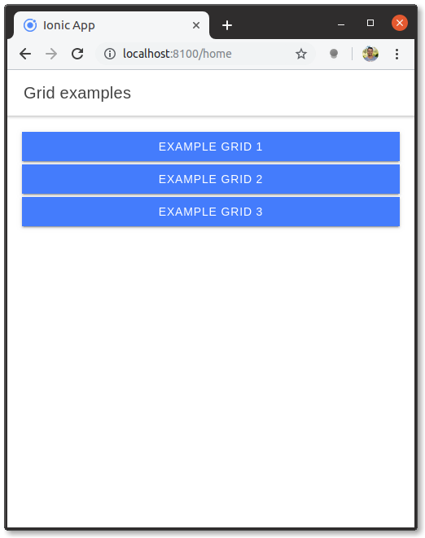
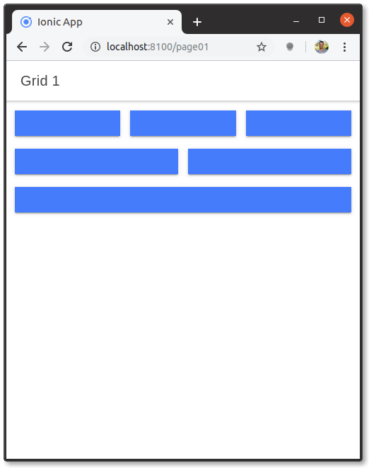
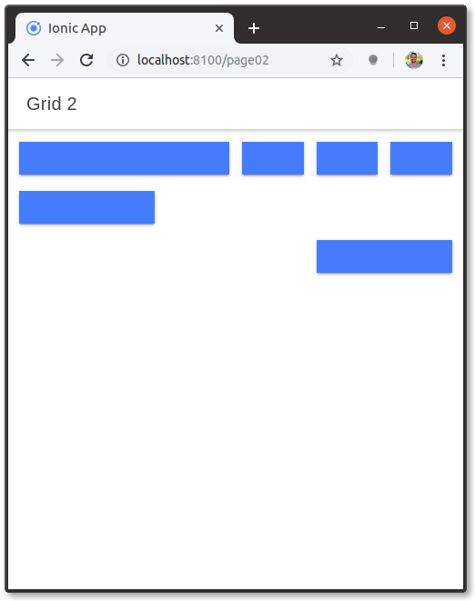
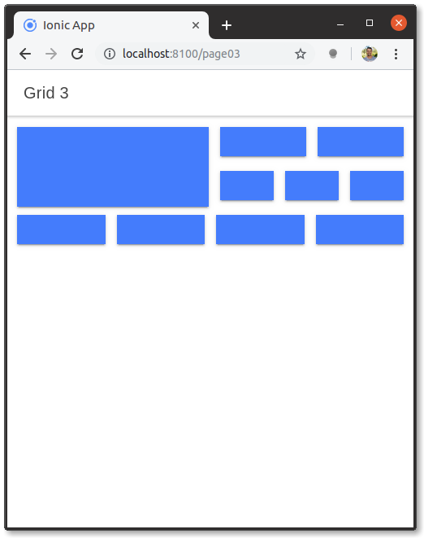

# Ionic grid examples

Grid examples with Ionic framework.

```html
<ion-header>
  <ion-toolbar>
    <ion-title>
      Grid examples
    </ion-title>
  </ion-toolbar>
</ion-header>

<ion-content>
  <div class="ion-padding">
    <ion-button expand="full" href="/page01">Example grid 1</ion-button>
    <ion-button expand="full" href="/page02">Example grid 2</ion-button>
    <ion-button expand="full" href="/page03">Example grid 3</ion-button>
  </div>
</ion-content>
```



```html
<ion-header>
  <ion-toolbar>
    <ion-title>Grid 1</ion-title>
  </ion-toolbar>
</ion-header>

<ion-content>
  <ion-grid>
    <ion-row>
      <ion-col>
        <ion-button expand="full"></ion-button>
      </ion-col>
      <ion-col>
        <ion-button expand="full"></ion-button>
      </ion-col>
      <ion-col>
        <ion-button expand="full"></ion-button>
      </ion-col>
    </ion-row>

    <ion-row>
      <ion-col>
        <ion-button expand="full"></ion-button>
      </ion-col>
      <ion-col>
        <ion-button expand="full"></ion-button>
      </ion-col>
    </ion-row>

    <ion-row>
      <ion-col>
        <ion-button expand="full"></ion-button>
      </ion-col>
    </ion-row>
  </ion-grid>
</ion-content>
```



```html
<ion-header>
  <ion-toolbar>
    <ion-title>Grid 2</ion-title>
  </ion-toolbar>
</ion-header>

<ion-content>
  <ion-grid>
    <ion-row>
      <ion-col size="6">
        <ion-button expand="full"></ion-button>
      </ion-col>
      <ion-col>
        <ion-button expand="full"></ion-button>
      </ion-col>
      <ion-col>
        <ion-button expand="full"></ion-button>
      </ion-col>
      <ion-col>
        <ion-button expand="full"></ion-button>
      </ion-col>
    </ion-row>

    <ion-row>
      <ion-col size="4">
        <ion-button expand="full"></ion-button>
      </ion-col>
    </ion-row>

    <ion-row>
      <ion-col size="8">
      </ion-col>
      <ion-col size="4">
        <ion-button expand="full"></ion-button>
      </ion-col>
    </ion-row>
  </ion-grid>
</ion-content>
```



```html
<ion-header>
  <ion-toolbar>
    <ion-title>Grid 3</ion-title>
  </ion-toolbar>
</ion-header>

<ion-content>
  <ion-grid>
    <ion-row>
      <ion-col>
        <ion-button expand="full" class="full-height"></ion-button>
      </ion-col>
      <ion-col class="no-padding">
        <ion-row>
          <ion-col>
            <ion-button expand="full"></ion-button>
          </ion-col>
          <ion-col>
            <ion-button expand="full"></ion-button>
          </ion-col>
        </ion-row>
        <ion-row>
          <ion-col>
            <ion-button expand="full"></ion-button>
          </ion-col>
          <ion-col>
            <ion-button expand="full"></ion-button>
          </ion-col>
          <ion-col>
            <ion-button expand="full"></ion-button>
          </ion-col>
        </ion-row>
      </ion-col>
    </ion-row>


    <ion-row>
      <ion-col>
        <ion-button expand="full"></ion-button>
      </ion-col>
      <ion-col>
        <ion-button expand="full"></ion-button>
      </ion-col>
      <ion-col>
        <ion-button expand="full"></ion-button>
      </ion-col>
      <ion-col>
        <ion-button expand="full"></ion-button>
      </ion-col>
    </ion-row>
  </ion-grid>
</ion-content>
```

```css
.full-height {
  height: 100% !important;
}
```


